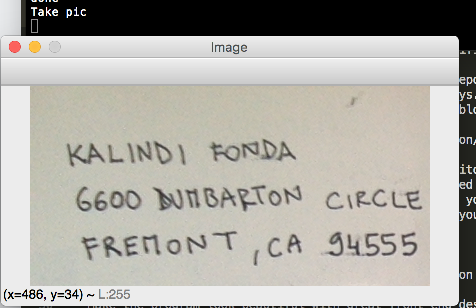
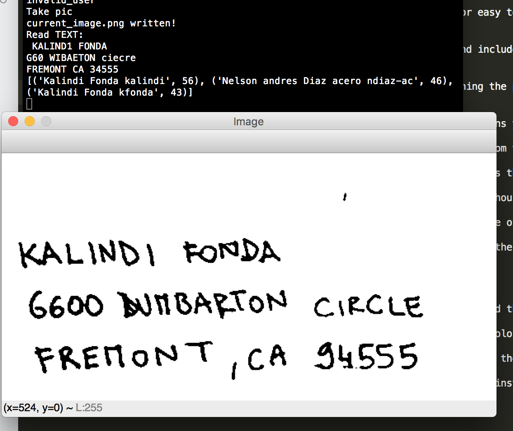

README.md


# Mail reader:

### Mail is coming in! Eager to manually insert all the names into the app for mail delivery notifications?
> Probably not.


### The power of code

There is a lot of mail coming in at 42 everyday, and students get an email from bocal (which is the admin) saying that mail has arrived. How does this happen? By manually typing the name and clicking the "add this person to the notification email list" button.
Programming school, you say, headache you say. So I decided to do this little project, that might make it a little less cumbersome, and that will take a picture of the letter front and search through users and select the one most likely to be the receiver of the letter.


### how is it made:
(now comes with webapp.....)

There are 2-3 components to this project

1. a webcam takes a picture, that is preprocessed through the cv2 library, and then OCRed with the Tesseract library. Results are +/- accurate, so whatever text is there gets fuzzysearched through ->

2. a list of all the names and logins of the students. By querying the [42 api](https://api.intra.42.fr), for all the active users on the Fremont campus, I got about 3000+ entries. This list of names should be updated every once in a while - TODO - i.e. new piscine start dates, and transfers. I am not using that list here (because privacy), but here is a list of a few of the people that worked in my vicinity, which made us learning buddies.

These steps work pretty well, but still require the human to stand there and do the clicking, so one can dream about some possible ->

3. hardware component (TODO)


### install

You might need to install a bunch of stuff - that you can find in the requirement.txt:

```
brew install python3
pip3 install -r requirements.txt
```

Any missing library, just `brew install` or `pip3 install` anything you don't have installed, until it runs!

Run with `flask run`

If you want changes to reflect without needing to restart check [this out](https://stackoverflow.com/questions/16344756/auto-reloading-python-flask-app-upon-code-changes). In order to get the static websites to refresh too, the app can prevent them from being [cached](https://stackoverflow.com/questions/41144565/flask-does-not-see-change-in-js-file)

### how to use:

After running go to page, place recipient address, take picture by clicking the buttons or folloing the keyboard shortcut instructions, good lighting helps.

The program outputs 3 options with First Name, Last Name, Intra, and a matching "relevance" score.
Click the appropriate key (either options, or repeat questions).
After a number is clicked, this user gets added to the user list, and a new picture can be taken.
You can also delete a specific user or the last one.


These are images from the terminal implementation, but this is what the program sees and the processed image, that gets run through tesseract!

Point, and shoot:


And this is what it sees



#### Resources:
- https://en.wikibooks.org/wiki/Python_Programming/Email
- https://medium.freecodecamp.org/getting-started-with-tesseract-part-ii-f7f9a0899b3f
- https://www.datacamp.com/community/tutorials/fuzzy-string-python
- https://towardsdatascience.com/natural-language-processing-for-fuzzy-string-matching-with-python-6632b7824c49
- https://stackoverflow.com/questions/287871/print-in-terminal-with-colors
- https://superuser.com/questions/751699/is-there-a-way-to-edit-a-commit-message-on-github


### TODOs and possible TODOs

-  [ ] functionality
	- [x] take automatic pictures until there is text
	- [ ] take automatic pictures until threshold is higher than 50
	- [ ] if more than 80 autoselect.
	- [ ] package vs mail
	- [ ] load more options
	- [ ] play around with the preprocessing more
	- [ ] take multiple pictures at once
	- [ ] text
		- [ ] do search line by line
		- [x] exclude the address from the result text
	- [x] delete
		- [x] add key to pop last if selected by mistake,
		- [x] remove user by typing name in
- [ ] notification
	- [ ] connect to the mailing system
	- [ ] ???js script to populate current hermez, or get functionality off of hermez???
- [ ] make it phisical
	- [ ] connect to a raspberry py or something such add webcam.
	- [ ] make a little delivery robot with selfdriving car to deliver to students using campus.42.us.org
- [ ] recipients
	- [ ] namelist care / update
	- [ ] email addresses (most have the student domain)
	- [ ] create system to update the static list of users.
	- [ ] if person not on list - manual entry
- [ ] webapp
	- [ ] show active/not active cam sections for the webapp.
	- [x] make webapp
	- [x] add instruction
	- [x] add some spinnig thing when waiting for photo
	- [ ] make app better
	- [ ] get it online.
- [ ] phoneapp


### Terminal version:

This is the web app, if you want to look at the version that can run from the terminal check here: https://github.com/KalindiFonda/mail_recipient_reader/tree/terminal_reader

### Aknowledgments:
Thanks to [Abdul](https://github.com/abdulrahmannmohamed) and [skunz](https://github.com/SebastianKunz) for talking it through with me and helping me in finding bits of code to copypasta!


GOOGLE CLOUD STUFF:
- https://cloud.google.com/appengine/docs/standard/python/getting-started/python-standard-env
- https://cloud.google.com/python/setup#installing_and_using_virtualenv

